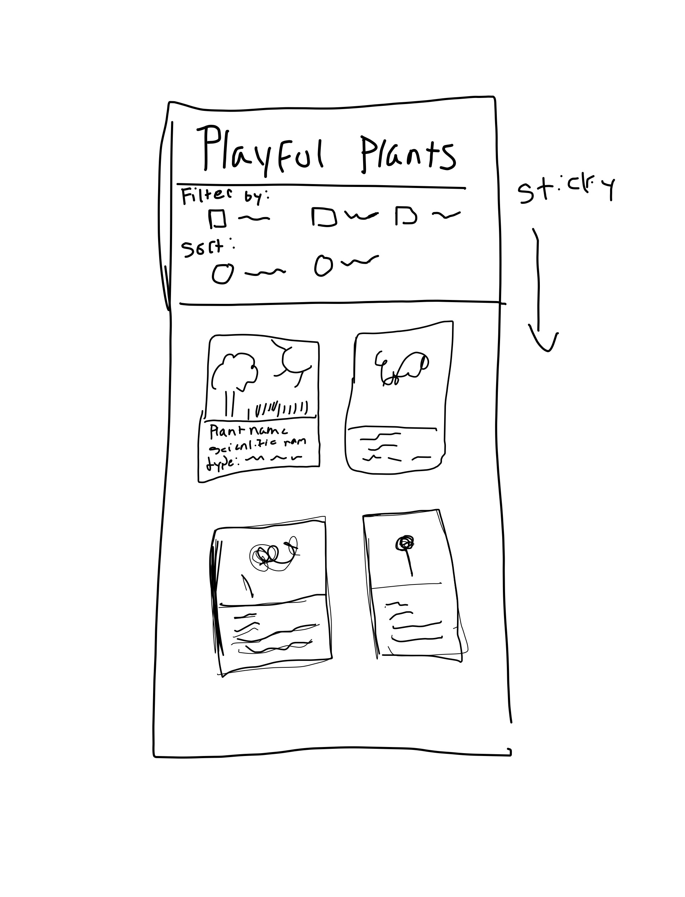

# Project 2: Design Journey

**For each milestone, complete only the sections that are labeled with that milestone.** Refine all sections before the final submission. If you later need to update your plan, **do not delete the original plan, leave it place and append your new plan below the original.** Explain why you are changing your plan. Remember you are graded on your design process. Updating the plan documents your process!

**Replace ALL _TODOs_ with your work.** (There should be no TODOs in the final submission.)

Be clear and concise in your writing. Bullets points are encouraged.

**Everything, including images, must be visible in Markdown Preview.** If it's not visible in Markdown Preview, then we won't grade it. We won't give you partial credit either. **Your design journey should be easy to read for the grader; in Markdown Preview the question _and_ answer should have a blank line between them.**


## Design / Plan (Milestone 1)

**Make the case for your decisions using concepts from class, as well as other design principles, theories, examples, and cases from outside of class (includes the design prerequisite for this course).**

You can use bullet points and lists, or full paragraphs, or a combo, whichever is appropriate. The writing should be solid draft quality.

### Audiences (Milestone 1)
> Who are your site's audiences?
> Briefly explain who the intended audiences are for your project website.
> **DO NOT INVENT RANDOM AUDIENCES HERE!** Use the audiences from the requirements.

_Consumer_: The consumer audeinces are parents who have young developing childre. These parents believe that it is important to use nature as a way to engage their children in play. These parents will want to be able to view the plants  and pick plants to create smaller scale garens for their children or other children in the community.

_Site Administrator_: The site adminstartor needs to be able to support the project reseachers who will need a serachable dtabases. Their priority is to be able to add, edit, delete entires. They also need the ability view the entries and share with other people. Their interaction with the playful plants website will be mostly professional.


### _Consumer_ Audience Goals (Milestone 1)
> Document your audience's goals.
> List each goal below. There is no specific number of goals required for this, but you need enough to do the job.
> **DO NOT INVENT RANDOM GOALS HERE OR STEREOTYPE HERE!** Your goals are things that your users want accomplish when using the site (e.g. print a list of plants). These are informed by the Playful Plants objectives. Review the assignment's requirements for details.

_Consumer_

Goal 1: The consumer will be casually viewing the site and therefore will want to view the website on their phone.

- **Design Ideas and Choices** _How will you meet those goals in your design?_
  - In order, to make viewing easy on the consumer, I will impelement CSS media queries, so taht the website is well visible on a mobile phone without squishing or shrinking of information.
- **Rationale & Additional Notes** _Justify your decisions; additional notes._
  - This is important because the user needs the website view to be accessible to the consumer where it is readable and usable. Thsi is done because media queries help alter the view of the website.

Goal 2: Additioanlly, the consumer needs the ability to sort and filter the plants to find the play type that they are looking for. This filtering and sorting option must be accesible to the user

- **Design Ideas and Choices** _How will you meet those goals in your design?_
  - I will implement a form that implements both filtering and sorting. This will allow the consumer to naviagate through the different plants. The filter and sort plant will be located at the top of the mobile version so that they do not have to scroll through the whole website to find it.
- **Rationale & Additional Notes** _Justify your decisions; additional notes._
  - This is important for the audiences goal's because the user needs the ability to only view a select amount of plants at a time rather than see the whole website at once. Moreover, they need the ability to do this without scrolling throuhg all of the plants that they do not want to see for accesiblity purposes


### _Consumer_ Persona (Milestone 1)
> Use the goals you identified above to develop a persona of your site's audience.
> Create your persona using GenderMag's customizable personas.
> Take a screenshot and include it here. Persona must be visible in Markdown Preview; do not use PDF format!


### _Administrator_ Audience Goals (Milestone 1)
> Document your audience's goals.
> List each goal below. There is no specific number of goals required for this, but you need enough to do the job.
> **DO NOT INVENT RANDOM GOALS HERE OR STEREOTYPE HERE!** Your goals are things that your users want accomplish when using the site (e.g. print a list of plants). These are informed by the Playful Plants objectives. Review the assignment's requirements for details.

_Administrator_ Goal 1: TODO: The adminstrator needs the ability to be able to edit entries with ease

- **Design Ideas and Choices** _How will you meet those goals in your design?_
  - I will implement an edit button that shows a form with the sticky values of the site. This way they can edit each entry, while not needing to retype the previous inormation.
- **Rationale & Additional Notes** _Justify your decisions; additional notes._
  - The design choice is the same as standards on other sites such as an edit profile button where your bio has a sticky value. This wil make it easy for the user to know how to use this feature of the site. Moreover, it will prevent them from needung ti retype info they already inputted


_Administrator_ Goal 2: TODO: The adminstrator needs the ability to be able to delete

- **Design Ideas and Choices** _How will you meet those goals in your design?_
  - I will implement a delete button that looks like a trash can. This is a common design standard on other websites and it will let the users know that they can delete the entry.
- **Rationale & Additional Notes** _Justify your decisions; additional notes._
  - This is a design choice that makes sense for the user. It follows the usual design standards seen on other sites. It also works to divesify the buttons on the site


_Administrator_ Goal 2: TODO: Emphasize information on play types

- **Design Ideas and Choices** _How will you meet those goals in your design?_
  - I will not add infomation about all of the gardening needs for each plant. Additionally, i will present the play types as a list so you only know which play types are included, so there isn't focus on the types not included.
- **Rationale & Additional Notes** _Justify your decisions; additional notes._
  - This choice makes the site overall easy to use for th user and only inlcudes the necessary infomation for the adminstrator.


### _Administrator_ Persona (Milestone 1)
> Use the goals you identified above to develop a persona of your site's audience.
> Create your persona using GenderMag's customizable personas.
> Take a screenshot and include it here. Persona must be visible in Markdown Preview; do not use PDF format!


### Site Design (Milestone 1)
> Document your _entire_ design process. **We want to see iteration!**
> **Show us the evolution of your design from your first idea (sketch) to the final design you plan to implement (sketch).**
> **Show us how you decided what data to display to each audience.**
> **Plan your URLs for the site.**
> **Provide a brief explanation _underneath_ each design artifact (2-3 sentences).** Explain what the artifact is, how it meets the goals of your personas (**refer to your personas by name**).
>
> **Important!** Plan _all_ site requirements. Don't forget login and logout.

_Initial Designs / Design Iterations:_


This iteration echos the design of my project two. For Tim, it puts a lot of emphasize on the catalog being a data input platform, where they he can manage it through edit and deleltion. It also allows for browsing, but less safistivagted layout as it is not Tim's main goal.


This iteration really simplifies the data entries. It makes it not as easy for viewing; however, it may make it harder for Tim to sort data, but Tim doesn't mind taking risks on wesbites this may work well with his cognititive style.


The gallery emphasizes a  more stylistic view that is better for browsing. However, it may not focus more on aesthetics than the add, deleting, and editing of plants. Tim may not like this style as it appears more commercial and less professional.


This sketch accounts fro what happens when there is no picture associated with the plant.


This set-up for the consumer relies haeavily on visuals putting emphasis on the pictures and making it more attratcie to engage with it. The sort and filter buttons are clearly seperated averting abi from any risk she may not want to take.


This style


This style is very similar to style one except it lays the plants out more vertically. While, spacially this may make sense abi may not be as likely to be able to distinguish between sorting an filtering this may cause her to be uncomforable using the features.


This sketch accounts fro what happens when there is no picture associated with the plant.


This log-in style is inspired by a more app like setup. It involves Tim's username and password for entry. It is failrly straightfoward and easy for Tim to use but may not be similar to some log-ins found online


This is a more traditional log-in screen like one seen on gmail and other web apps. I beleive that Tim will have an easy time usi g this as it is similar to others online.




This sketch is for Abi mobile version of the site it is easy to use becasue the filter and sort keys are at the top of the screen so you dont have to scroll to submit. This utilizes two images per page to prevent accessive scrolling for abi.


This is similar to the first layout; however, abi is only able to see one gallery card at once. Considering how small a phone is this may make more sense for her viewing.


This page is for viewing of a plant as a pop-up it displays the plant and the image first. The ID is on top and the content is underneath like a caption. It also gives tim the option ot edit and delete the plant here so he doesn't have to backtrack.


This puts the image more on the side making this screen more compat. However, I think this may have too much white space for Tim.It also gives tim the option ot edit and delete the plant here so he doesn't have to backtrack.

_Final Design:_

View descriptions above


[log-in](final_admin.jpg)
This Final page was generated to better meet tims needs such as not including pictures.


This final user page was made to better suit abi needs. It includes a view button for reading which abi likes visual cues as she reads the whole site.


### Design Pattern Explanation/Reflection (Milestone 1)
> Write a one paragraph (6-8 sentences) reflection explaining how you used design patterns for media catalogs in your site's final design.

These designs for the adminstrators have a more professional text based feel. It follows the conventions of a tradional library catalog with the image on the lefgt and the infomation to the right / underneath. It also follows traditional design patterns as it doesn' include unnessary lines or details ot clutter the catalog. For Abi, this catalog aligns with conventions because it looks simialr to the seed page that we have been shown in class. It includes a large image of the plant. In addition, it had all of the infomraiton below that central image. It focuses more on aestheics and redablity as well as spacing.


### Cognitive Styles Explanation/Reflection (Milestone 1)
> Write a one paragraph (6-8 sentences) reflection explaining how your final design supports the cognitive styles of each persona. In order to align with Abi needs, I tried to communicate that any sort of sorting or filtering can be undo on the site. I also provided X keys on any sort of pop-up so they know that they can retur to the original seen.

_Consumer Cognitive Styles Reflection:_

In order to support Abi's cognitive style tI wil make sure that all of the buttons on the sire have a clear indication of what they do. She doesn't like to task so the buttons being clear will steer her in the right direction on the site. This also includes clear labels on forms as well. I also incoperatee directions on how to use the forms so that Abi isn't afraid to make a mistake. Additoonally, when it came to linking to ht pop-ups with the indivual plant info. I din't want to make an assumption that the use would click on these so I create a link that would tell the user that they would be viewing more if they cliked on ot.


_Site Administrator Cognitive Styles Reflection:_

In order to match Tim's cognitive style, I will try to implement less features and make the features that I implement not to complex and by design standards. This is because Tim likes to spend a long time creating a mental model for himself; therefore, to support Tim stuyle I want to make it easy for him to make a mental model. In my design this includes only having buttons that are all clearly labeled that way any tinkering is supporting a mental model. While, these clearly labeled buttons will help Tim create  mental model he alsp likes to tinker with the sites. Therefore, I elimated some of the extra sinstructions needs for abi. Instead of a link, I also allowed him to directly just clikc on plants on the gallery.


## Implementation Plan (Milestone 1, Milestone 2, Milestone 3, Final Submission)

### Database Schema (Milestone 1)
> Describe the structure of your database. You may use words or a picture. A bulleted list is probably the simplest way to do this. Make sure you include constraints for each field.
> **Hint: You probably need a table for "entries", `tags`, `"entry"_tags`** (stores relationship between entries and tags), and a `users` tables.
> **Hint: For foreign keys, use the singular name of the table + _id.** For example: `image_id` and `tag_id` for the `image_tags` (tags for each image) table.

Table: TODO

- field1: TYPE {constraints...},
- field2...
- TODO


### Database Query Plan (Milestone 1, Milestone 2, Milestone 3, Final Submission)
> Plan _all_ of your database queries. You may use natural language, pseudocode, or SQL.

```
ADMISTRATOR PAGE

GRABBING THE TAGS FOR PLAY TYPE ONLY


SELECT tags.tag AS 'tags.tag' FROM plants_tags INNER JOIN tags ON (plants_tags.tag_id = tags.id) WHERE  (plants_tags.plant_id = the plant you want )  AND (plants_tags.tag_id < 9)


SELECTING  EVERYTHING FROM THE DATABASE
```
"SELECT
plants.id AS 'plants.id',
plants.c_name AS 'plants.c_name',
plants.s_name AS 'plants.s_name',
plants.playful_plant_id AS 'plants.playful_plant_id',
tags.tag AS 'tags.tag',
plants_tags.tag_id AS 'plant_tags.tag_id',
plants_tags.plant_id AS 'plants_tags.plant_id',
plants.file_extension AS 'plants.file_extension'
FROM
plants_tags
INNER JOIN plants ON plants_tags.plant_id = plants.id
INNER JOIN tags ON plants_tags.tag_id = tags.id  GROUP BY PLANT.ID";

```
SELECTING ONE ITEM
```
"SELECT
plants.id AS 'plants.id',
plants.c_name AS 'plants.c_name',
plants.s_name AS 'plants.s_name',
plants.playful_plant_id AS 'plants.playful_plant_id',
tags.tag AS 'tags.tag',
plants_tags.tag_id AS 'plant_tags.tag_id',
plants_tags.plant_id AS 'plants_tags.plant_id',
plants.file_extension AS 'plants.file_extension'
FROM
plants_tags
INNER JOIN plants ON plants_tags.plant_id = plants.id
INNER JOIN tags ON plants_tags.tag_id = tags.id  WHERE plant.id = id you want


INSETING INTO DATAbase

INSERT INTO plants (playful_plnat_id , name_c , name_s)VALUES  (planful_plant_id,  name_c , name_s, file_extension)

for each tag
INSERT INTO plants_tags (plant_id, tag_id )VALUES  (plant_id, tag_id )


UPDATING DATABASE

GROUP BY PLANT.ID"


CONSUMER PAGE


SELECTING  EVERYTHING FROM THE DATABASE
```
"SELECT
plants.id AS 'plants.id',
plants.c_name AS 'plants.c_name',
plants.s_name AS 'plants.s_name',
plants.playful_plant_id AS 'plants.playful_plant_id',
tags.tag AS 'tags.tag',
plants_tags.tag_id AS 'plant_tags.tag_id',
plants_tags.plant_id AS 'plants_tags.plant_id',
plants.file_extension AS 'plants.file_extension'
FROM
plants_tags
INNER JOIN plants ON plants_tags.plant_id = plants.id
INNER JOIN tags ON plants_tags.tag_id = tags.id  GROUP BY PLANT.ID";

```
SELECTING ONE ITEM
```
"SELECT
plants.id AS 'plants.id',
plants.c_name AS 'plants.c_name',
plants.s_name AS 'plants.s_name',
plants.playful_plant_id AS 'plants.playful_plant_id',
tags.tag AS 'tags.tag',
plants_tags.tag_id AS 'plant_tags.tag_id',
plants_tags.plant_id AS 'plants_tags.plant_id',
plants.file_extension AS 'plants.file_extension'
FROM
plants_tags
INNER JOIN plants ON plants_tags.plant_id = plants.id
INNER JOIN tags ON plants_tags.tag_id = tags.id  WHERE plant.id = id you want


FILTERING

"SELECT
plants.id AS 'plants.id',
plants.c_name AS 'plants.c_name',
plants.s_name AS 'plants.s_name',
plants.playful_plant_id AS 'plants.playful_plant_id',
tags.tag AS 'tags.tag',
plants_tags.tag_id AS 'plant_tags.tag_id',
plants_tags.plant_id AS 'plants_tags.plant_id',
plants.file_extension AS 'plants.file_extension'
FROM
plants_tags
INNER JOIN plants ON plants_tags.plant_id = plants.id
INNER JOIN tags ON plants_tags.tag_id = tags.id  WHERE tags.tag = 'tag you want GROUP BY PLANT.ID"'


### Code Planning (Milestone 1, Milestone 2, Milestone 3, Final Submission)
> Plan any PHP code you'll need here using pseudocode.
> Tip: Break this up by pages. It makes it easier to plan.

```
TODO: WRITE YOUR PSEUDOCODE HERE, between the back-tick lines.
```
_Adminstrator page_

CREATING FEEDBACK FOR ADD PLANT FORM

set inputs you want to have feedback to empty hidden values so that data only displays when not selected
$plant_id_feedback = 'hidden'
$name_c_fededback = 'hidden'
$name_s_feedback = 'hidden'
$type_feedbacl = 'hidden'

use echo to show certain text when default of hidden is removed from the variables

CODE FOR STICKY ADD PLANT FORM

if form valid{ submit it }
if form not valid{
    keep the valid values saved
    add feedback to each of the values that are invalid
}


CODE FOR STICKY FILTER FORM

$sql_select_part = create a joins query to join Plant_id and tag_id and tags sot aht tags are correlated with ids and plants

if value is check  when the filter/sort button is pressed save that value
by assigning it to  the coresponding sticky
statemnt to a statement that checks whether or not the box is checked
$sticky_filter = ($filter == 'filter_...' ? 'checked' : '');

if the box is checked:
  $sql_where_part = set the sql where box to that tags.tag_id

create a query that concates all of these factors

$sql_query = $sql_select_part . $sql_where_part . $sql_order_part;


 INSERTING INTO DATABSE

set the varable SELECT * FROM plants;
then fetch the varable
attempt the creat a loop to populate databse in a way that lays out the data base and only prints plant types applicable


INSERTING INTO DATA


if the form is valid {
    set a varaible equal to the exec_SQL query(make sure it connects to data base, use INSERT INTO plants(with all plant values) and assign these values ,
    array (
        indicating correpsinding value and varaibale)
    )
    This data also needs to be posted to the dataset
        If false{ there needs to be sticky value}

If statement if all play related ags are empty or if all gardening tags are empty
  then form will not process
  and there will be stikcy vales

If (1 of each type has been checked)
If it is expository play that is check
  set cariable equal to exec_sql and make sute it connects to database use INSERT INTO plants_tags wth all play tag vales and assign these to the values
If it is sesnory play that is check
  set cariable equal to exec_sql and make sute it connects to database use INSERT INTO plants_tags wth all play tag vales and assign these to the values
  If it is imnaginativ eplay that is check
  set cariable equal to exec_sql and make sute it connects to database use INSERT INTO plants_tags wth all play tag vales and assign these to the values
    If it is restorative eplay that is check
  set cariable equal to exec_sql and make sute it connects to database use INSERT INTO plants_tags wth all play tag vales and assign these to the values
}
   If it is bio play that is check
  set cariable equal to exec_sql and make sute it connects to database use INSERT INTO plants_tags wth all play tag vales and assign these to the values
}
   If it is play  with rules that is check
  set cariable equal to exec_sql and make sute it connects to database use INSERT INTO plants_tags wth all play tag vales and assign these to the values
}
 If it is play  with rules that is check
  set cariable equal to exec_sql and make sute it connects to database use INSERT INTO plants_tags wth all play tag vales and assign these to the values
}
 If it is physical play s that is check
  set cariable equal to exec_sql and make sute it connects to database use INSERT INTO plants_tags wth all play tag vales and assign these to the values
}

 If it is annaula that is check
  set cariable equal to exec_sql and make sute it connects to database use INSERT INTO plants_tags wth all play tag vales and assign these to the values
}
 If it is perenial that is check
  set cariable equal to exec_sql and make sute it connects to database use INSERT INTO plants_tags wth all play tag vales and assign these to the values
}

 If it is partial shde is check
  set cariable equal to exec_sql and make sute it connects to database use INSERT INTO plants_tags wth all play tag vales and assign these to the values
}
 If it is full shade is check
  set cariable equal to exec_sql and make sute it connects to database use INSERT INTO plants_tags wth all play tag vales and assign these to the values
}
 If it is full sun is check
  set cariable equal to exec_sql and make sute it connects to database use INSERT INTO plants_tags wth all play tag vales and assign these to the values
}
}


If user logged in ...
show the plant_id sort hide desciprion and show add form
else
show description


QUERYING AND VIWING ONE ITEM

details-page?id=id

EDITING THE PAGE

create a button that if pressed opens up a new edit page. By using the id to get the information the form will be able to edit the exisitng plant details

get the id using a get request then
create and if statemen to find if the record exists
if it does get the varables and set them to a value $c_name  = $record['name from table']

set these values equal to a sticky value that will be shown in the form name $sticky_c_name  = $c_name

to query the tags create a foreach loop that loops through all the tags that you queried from the plant that have the specific $plant_id that you got from the original $_GET

Then check if $tag_query[tags.tag] == play type tags{
  set the sticky of that play_Type tag to true
}

in the form if the sticky value is set to true then check it

create a $valid_form varaible and set it to true
To edit the plant confirm that each of the fields !empty for c_name, s_name, playful_plant_id
Ensure that at least one plant tag is checked off  !empty(sensory) || !empty(expressive) so on and so fourth
if any of these are not fufilled changed the variable to false
  set sticky values for each of the ones fufilled by echo out the variable as a value
  to the ones not filled echo out a message

Once $valid_form is still true
  use UPDATE query to update everything in plants table

Create a for loop witht the plants and loop through the forloop checking if they are checked in the database and need deleted if unchecked

check if the checks that are checked now are not already in databse and if not add them


DELETE AN ITEM

create a form in html with hidden input this input will store the value of each plant id , so you know what to delete
<input type='hidden' name='deleteid' value= echo id >
<input submit name=delete_form value=delete  >

then when this button is pressed on each indivual form the user will be to delete

use isset($POST_delete_form){
  $varaible = to the POST['deleteid'] - gets value
  do an sql query that deletes the variable from plants where the id = $varible (info from form )
   do an sql query that deletes the variable from plants_tags where the tag_id = $varible (info from form )
}
varaible needs to be intailized before hand
}


CONSUMER PAGE


CODE FOR STICKY FILTER FORM

if value is check  when the filter/sort button is pressed save that value
by assigning it to  the coresponding sticky
statemnt

 INSERTING INTO DATABSE

set the varable SELECT * FROM plants;
then fetch the varable
attempt the creat a loop to populate databse for each entry that includes scientific name, collequila name, and a gardening description.

QUERYING AND VIWING ONE ITEM

details-page?id=id


### Accessibility Audit (Final Submission)
> Tell us what issues you discovered during your accessibility audit.
> What do you do to improve the accessibility of your site?

In performing the accessibility audit I found that most of my issues were context relate or an issue with ill -lablled content. In order, to fix these two issues, I fixed the labels and darkened colors when approriate.


## Reflection (Final Submission)

### Audience (Final Submission)
> Tell us how your final site meets the goals of your audiences. Be specific here. Tell us how you tailored your design, content, etc. to make your website usable for your personas.

My site meets the needs of Abi as it allows her to gather the information necessary for knowing how to grow a garden. Abi will need to know season it grows in annual vs pernnial. She will also need to know what kind of plant it is and what light is required. Abi can filter to look for different plants and she can also click on the plants to view pictures and plant information of each plant. This meets Abi's generally nees. However, it also meets her cognitive styles to prevent her from blaming herself. For instance, when there are no images avaible there is a plave holder image so that Abi doesn't blame herself for not being able to see the image. Moreover, the plants I was given some of the categoreis have no specific plants of that type. Therefoere, in order to make Abi not frustrated with herself. I added a message to tell her that there are no plants avaible. Additionally, I have a navigation bar on the log-in page and in the 404 page so that Abi doesn't doubt herself when seh can't naviagate back to the home page.

My site also meets the admins needs. It allows the admin to add new plants, edit existing plants, delete previous plants. This meets Tim's needs as he is able to edit all of the information that he needs for the consumer site. Tim is more willing to learn and doesn't immediately blame himself when something goes wrong. Therefore, Tims site doesn't have pictures as Tim wouldn't mind looking on the consumer site to make sure that they were properly uploaded. Moreover, Tim also doesn't get prompted yes or no for the delete button as he is fine expemetning and would not mind re-entering a deleted entry. Moreover, this design meets Tim's needs as it is more simplistic sna experimental.


### Additional Design Justifications (Final Submission)
> If you feel like you haven’t fully explained your design choices in the final submission, or you want to explain some functions in your site (e.g., if you feel like you make a special design choice which might not meet the final requirement), you can use the additional design justifications to justify your design choices. Remember, this is place for you to justify your design choices which you haven’t covered in the design journey. You don’t need to fill out this section if you think all design choices have been well explained in the design journey.

I decided not to include filtering on the admin side as Tim doesn't mind looking around the site and is okay taking a little more time on the site and won't blame himself right away. Moreover, the admin aren't growing plants and are mostly working to tailor the site to the consumer so they are less likely to need filtering for this reason


### Self-Reflection (Final Submission)
> Reflect on what you learned during this assignment. How have you improved from Project 2? What would you do differently next time?

I have learned a lot since project two. During this assignemt. Iw as able to improve my design by increasing the spacing on my forms. I also was able to implment a more visual aspect of my design with the user of pcitures in the catalog. As well as able to create different style buttons that may be more intesting to the user. Moreover,I was able to clean up the database by using JOINS. For next, time I think that I could have better code formattingand indenting, which could possibly help me implement cahanges in php easier. Futhermore, I bleieve that I could have created more organized and user friendly forms. However, since my persona does not mind making mistakses this isn't the worst design flaw, but I do beleive that they could be more sophisticated.


> Take some time here to reflect on how much you've learned since you started this class. It's often easy to ignore our own progress. Take a moment and think about your accomplishments in this class. Hopefully you'll recognize that you've accomplished a lot and that you should be very proud of those accomplishments!

While, I have at times found php and SQL to me quite challenging, I beleive that I have learned a lot throughout the duration of theis course. I have learned to code a whole website back end and front end, which is quite a lot of content.More specifically, I have learned how to implement edit, delete, insert, and filter forms. I also have learned image uploads and user contols. This is so much material that I was able to learn in just a short amount of time this semester. Not only that, but I have coded three whole websites this semester. I also finsihed my personal website as one of our class projects. In addition to coding, I have learned about creating personas, gender mag, coginitive walk through which can all make a site more accessible.


### Grading: Step-by-Step Instructions (Final Submission)
> Write step-by-step instructions for the graders.
> The project if very hard to grade if we don't understand how your site works.
> For example, you must login before you can delete.
> For each set of instructions, assume the grader is starting from /

_View all entries:_

1. To view all entries from the consumer in you just need to debug the website. And it will be avaible on the homepage.
2. After, filtering /sorting you can also view all the plants by filtering by show all plants. Once logged in you can view all plants on the site.


_View all entries for a tag:_

1. You can view all the entries for a specific tag by selecitng that tags radio button
2. and pressing the sibmi aks filter/sort button on the form.

_View a single entry's details:_

1. In order to view a single data entry. You will need to locate the view plant details button, which will be located on the homepage in the catalog.
2. Then select that button, which will bring yo to a page wit all of the plant details.
2.

_How to insert and upload a new entry:_

1. In order to insert a new entry, the user will need to press the log-in button (located in nav bar).
2. This will bring them to the log-in page. The username and password is Caitlyn (capital C) with password monkey.
3. This will redirect the user to to the admin home page.
4. Here the user will scroll to the bottom of the catalog
5. user will fill out each of the sections
6. user will then presss submit.


_How to delete an entry:_

1. The user will need to navigate to the log-in page from the naviagation bar.
2. Then they will need to enter the user name and password. The user name is Caitlyn (with a capital C) and the password is the monkey
3. This will redirect them to the admin page
4.  As the user scrolls through the catalog, they will see a delete icon. They must press on this icon in order to delete the item.

_How to edit and existing entry and its tags:_

1. The user will need to navigate to the log-in page from the naviagation bar.
2. Then they will need to enter the user name and password. The user name is Caitlyn (with a capital C) and the password is the monkey
3. This will redirect them to the admin page
4. The user will then scroll through the catalog to find the entry they want to edit
5. they will slecte the edit icon.
6. this will redirct them to the edit page.
7. From here they will make any changes they need to
8. They will press submot to apply the changes
0. refresh page to see the changes
